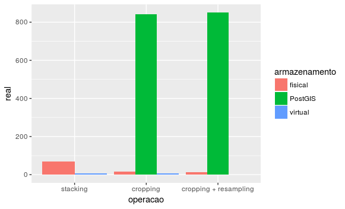

# Benchmark das operações com raster

Intenciona-se comparar o tempo gasto nas seguintes operações com raster:

1. stacking all raw data
2. cropping the raster stack for a bounding box of interest (simulating the
   study area and projection area)
3. cropping the raster stack for a bounding box and resampling the pixel size

Nas seguintes formas de armazenamento:

1. fisical raster format
2. virtual raster format
3. PostGIS

## Método de coleta do tempo

Cada comando `gdal` referenciado em [RasterMngmt/README.md](../README.md) foi
executado 100 vezes. O tempo gasto para fazer essas 100 operações foi armazenado
num CSV.

Os seguintes tempos foram armazenados:

* real
* user mode
* kernel mode

O que cada um desses tempos significa pode ser lido
[aqui](https://stackoverflow.com/a/556411). Os gráficos mostrarão somente o
tempo *real*.

O comando usado para os testes foi o seguinte:

```shell
TIMEFORMAT="%R;%U;%S;operacao;armazenamento"
{ time for a in {1..100}; do COMANDO_GDAL > /dev/null; done; } 2>>
~/benchmark_raster.csv

```

Para entender o redirecionamento da saída do *builtin* `time` leia
[aqui](http://mywiki.wooledge.org/BashFAQ/032). O formato da variável
`TIMEFORMAT` pode ser lido na `man bash`.

## Resultados

Todos os valores abaixo estão expressos em segundos:

### Fisical

real|user|kernel|operação
----|----|------|--------
70.368|47.923|22.237|stacking
15.441|10.494|4.758|cropping 
13.648|9.628|3.953|cropping + resampling

### Virtual

real|user|kernel|operação
----|----|------|--------
8.075|6.154|1.861|stacking
5.388|3.724|1.608|cropping
0|0|0|cropping + resampling

:warning:
O script R informado para *cropping + resampling* não termina com sucesso. O
seguinte erro acontece:

```
Error in as.list.environment(environment()) : 
  nenhum slot de nome "bbox" para esse objeto de classe "standardGeneric"
Calls: gdalbuildvrt -> as.list -> as.list -> as.list.environment
Execução interrompida
```

Também não seria ideal comparar um comando dedicado (como foi feito até esse
ponto) com um script R. Como fazer essa operação com um comando `gdal`?
:warning:

### PostGIS

:warning:
Não ficou claro para mim que comando medir. Seria o tempo de execução de
`importRasterPG.sh`?

Esse script não foi incluído no repositório.
:warning:

### Gráfico comparativo

O CSV resultante foi lido e plotado com ggplot2:

```R
bench <- read.csv("~/benchmark_raster.csv", sep=';')

# Reordena o factor para stacking ser impresso primeiro no gráfico
bench$operacao <- factor(bench$operacao, levels(bench$operacao)[c(3,1,2)])

# Plota o gráfico
ggplot(bench, aes(operacao,real, fill=armazenamento)) +
geom_bar(stat='identity', position=position_dodge())
```



## Observações e considerações finais

* A grande diferença de tempo na operação de *cropping* entre os VRTs e rasters
  físicos não devem ser interpretadas como uma ineficiência dos rasters físicos.

O 1º tempo é o tempo de processar as operações em si; o 2º, meramente de
**descrevê-las** em XMLs. Da documentação citada:

> The intermediate files, instead of containing the raw raster output of the
> actual computation, are XML files which contain the instructions to get the
> desired output. This allows GDAL to do all the processing in one step (the
> final step #3).

Qual nosso caso de uso? Para modelagem, vamos precisar acessar o raster
transformado em si, certo?

* Para
  [cropping + resampling](https://github.com/Model-R/RasterMngmt#c-cropping-the-raster-stack-for-a-bounding-box-and-resampling-the-pixel-size-1)
com VRTs seria ideal medirmos o tempo de uma ferramenta `gdal`, não um script R
como foi apresentado.

* Estou considerando que o [glob](http://mywiki.wooledge.org/glob) para as operações de stacking
  ([1](https://github.com/Model-R/RasterMngmt#a-stacking-all-raw-data),[2](https://github.com/Model-R/RasterMngmt#a-stacking-all-raw-data-1)) é
  `bio?([0-9])[0-9].tif` e não `*.tif`.
